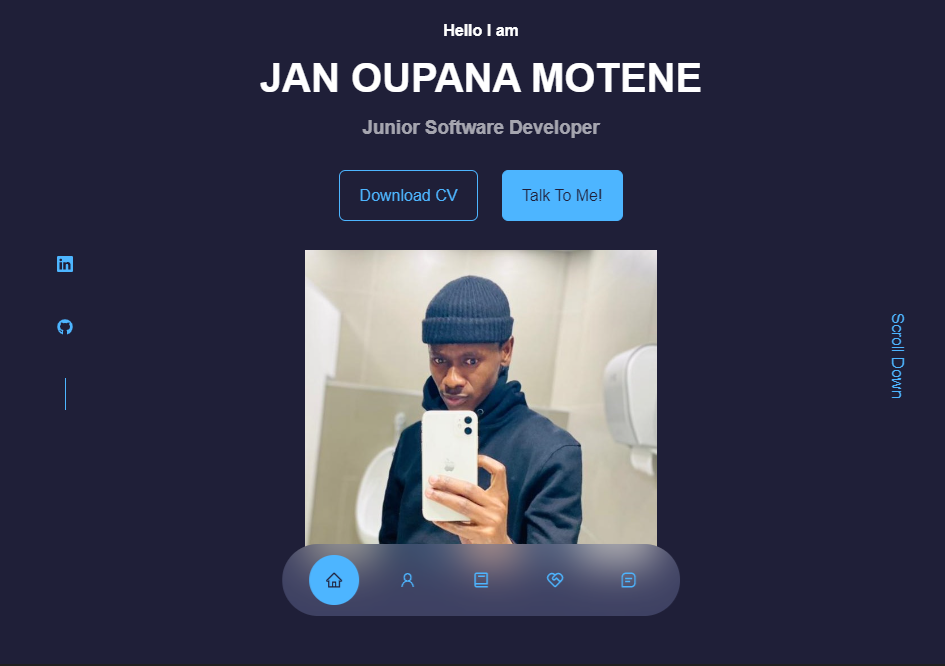

<h1 align="center">
    
</h1>

<!--

    

-->

    Innovative Software Developer and Data Scientist whose passionate for creating innovative solutions and exploring technology.

  
  
  

| **My**       | **ToolBox**                                                                                                      |
|-----------------|-----------------------------------------------------------------------------------------------------------|
| IDE             |                                                      |
| App Development  |                                 |
| Data Science  |                                 |
| Front End       | |
| Back End        |         |
| Others          |    |

## 🦇 Fun Fact:
A fun fact about me is that I enjoy working on some really innovative projects, I'm blending creativity with technology.

## 👩🏻‍💻 Favorite Quote:
"Strive not to be a success, but rather to be of value." – Albert Einstein

This quote resonates deeply with me as I navigate the world of Software Engineering, Data Science and Technology.

## 📫 Let's Connect🚀:
I’m always open for collaborations and discussions. Feel free to reach out, Looking forward to connecting with you!

    
   

<!--

  

-->

<!--
**MoteneJan/MoteneJan** is a ✨ _special_ ✨ repository because its `README.md` (this file) appears on your GitHub profile.

Here are some ideas to get you started:

- 🔭 I’m currently working on ...
- 🌱 I’m currently learning ...
- 👯 I’m looking to collaborate on ...
- 🤔 I’m looking for help with ...
- 💬 Ask me about ...
- 📫 How to reach me: ...
- 😄 Pronouns: ...
- ⚡ Fun fact: ...
-->
